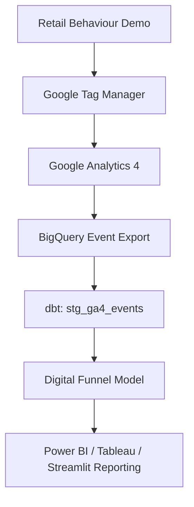

# GA4 + GTM Tracking Plan

This project adds a small, clearly labelled retail behaviour demo to complement the existing transactional analytics platform. The demo is not production traffic. Its purpose is to show how GA4 ecommerce events would be collected through GTM and then modelled in SQL/dbt.

## Event Model

| Business Question | GA4 Event | Parameters | Why It Matters | Potential KPI |
|---|---|---|---|---|
| Which products attract the most interest? | `view_item`, `view_item_list` | `item_id`, `item_name`, `item_brand`, `item_category`, `price`, `currency` | Separates product interest from completed sales. | Product views, view share |
| Which products are viewed frequently but rarely purchased? | `view_item`, `add_to_cart`, `purchase` | `item_id`, `value`, `quantity`, `transaction_id` | Finds high-interest/low-conversion products. | Product conversion rate |
| Where are users dropping out of the conversion funnel? | `view_item_list`, `view_item`, `add_to_cart`, `begin_checkout`, `purchase` | `session_id`, `device_category`, `source`, `medium` | Turns journey steps into reusable funnel metrics. | Step conversion, drop-off rate |
| Which acquisition sources generate the highest-value customers? | `page_view`, `view_item`, `purchase` | `source`, `medium`, `campaign`, `value`, `currency` | Connects traffic quality to commercial value. | Revenue per user/session |
| Does discounting improve conversion? | `view_item`, `add_to_cart`, `purchase` | `discount`, `price`, `item_id`, `value` | Tests whether discounts create engagement or only reduce margin. | Add-to-cart rate by discount |
| Which brands generate strong engagement but weak sales? | `view_item`, `add_to_cart`, `purchase` | `item_brand`, `item_id`, `value` | Supports pricing, merchandising and positioning analysis. | Brand conversion rate |
| Which product categories drive repeat engagement? | `view_item`, `select_item` | `item_category`, `user_pseudo_id`, `session_id` | Distinguishes casual browsing from repeat interest. | Returning user views |
| Which campaigns generate traffic but poor outcomes? | `page_view`, `view_item`, `purchase` | `campaign`, `source`, `medium`, `value` | Prevents reporting campaign volume without commercial quality. | Campaign conversion rate |
| Which filters reveal customer intent? | `filter_applied` | `filter_name`, `filter_value`, `item_category` | Custom event justified because GA4 has no exact standard filter event. | Filter usage, filtered conversion |
| How do users interact with the analytics dashboard? | `dashboard_interaction` | `dashboard_name`, `interaction_type`, `chart_name` | Useful only for the existing Streamlit dashboard if dashboard usage is tracked separately from ecommerce behaviour. | Dashboard engagement |

## Implemented Demo Events

The tracked demo page currently pushes these events to `window.dataLayer`:

- `view_item_list`
- `select_item`
- `search`
- `view_item`
- `add_to_cart`
- `begin_checkout`
- `filter_applied`

`purchase` is specified and modelled but not fired by the demo, because this repository does not contain a real checkout or payment workflow.

## GTM Setup

1. Create a Google Tag Manager account and Web container.
2. Copy the container ID, for example `GTM-XXXXXXX`.
3. Set it locally before running the demo:

```powershell
$env:GTM_CONTAINER_ID="GTM-XXXXXXX"
python -m src.digital_analytics.demo_site
```

4. Open `http://127.0.0.1:8502`.
5. In GTM Preview mode, connect to the demo URL and confirm the dataLayer events fire as interactions happen.

## GA4 Setup

1. Create a GA4 property.
2. Add a Web data stream.
3. Copy the Measurement ID, for example `G-XXXXXXXXXX`.
4. In GTM, create a Google Tag or GA4 Configuration tag using the Measurement ID. The demo app itself does not need the Measurement ID when GTM is handling GA4 forwarding.
5. Create GA4 Event tags that listen to the custom event names pushed into `dataLayer`.
6. Map ecommerce parameters from the `ecommerce` object.
7. Test with GTM Preview, then GA4 DebugView and Realtime.

## Data Flow



## Data Quality Expectations

- `item_id` must be present for item events.
- `purchase.value` cannot be negative.
- `transaction_id` is required for purchase events and should be unique.
- Event names must come from the recognised tracking specification.
- Synthetic fixtures must be labelled with `is_synthetic = true`.
- Funnel analysis should not invent unavailable steps.
